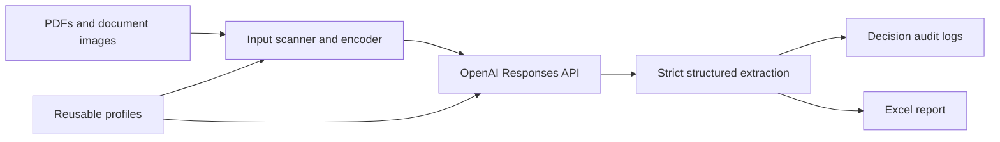
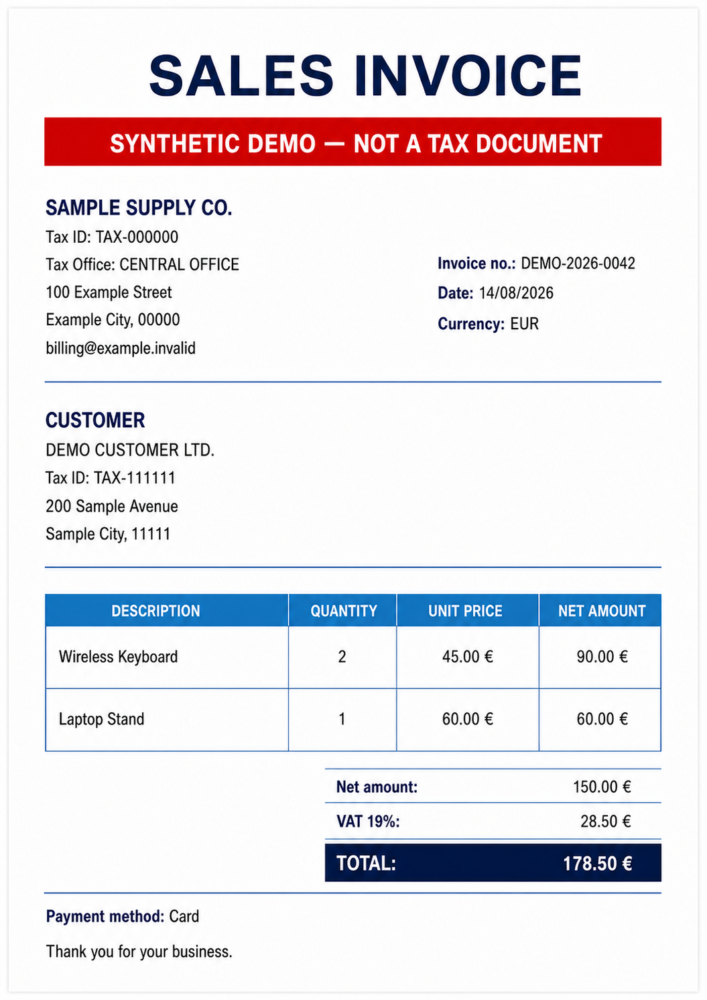

# Prompt Tester

**A Windows desktop workbench for prompt-driven document extraction, decision auditing, and Excel reporting.**

Prompt Tester processes PDFs and document images with the OpenAI Responses API. It is designed for the unglamorous but important parts of extraction work: repeatable profiles, strict schemas, batch resilience, cost visibility, and evidence that a reviewer can audit.

## Why this project exists

Moving from a promising extraction prompt to a repeatable document workflow usually requires more than a single API request. Teams need to group pages correctly, preserve identifiers, survive partial failures, compare models and costs, and understand why a value was returned.

The application brings that workflow into one local desktop experience:

- Scan folders containing PDFs or multi-page image documents.
- Define any extraction schema without changing application code.
- Save reusable prompt, field, model, and processing profiles.
- Request strict JSON Schema output with string, array, or null values.
- Preserve leading zeros and repeated values in Excel.
- Record field evidence, confidence, ambiguity, warnings, response metadata, token usage, and estimated cost.
- Cancel safely and retain a partial report for completed documents.

## Highlights

- Native .NET 10 WPF interface with light and dark themes.
- GPT-5.6 Sol, Terra, and Luna, plus compatible GPT-5.5, GPT-5.4, GPT-4.1, and GPT-4o models.
- PDF, JPEG, PNG, WebP, BMP, TIFF, and non-animated GIF input handling.
- Natural page ordering such as `page_1`, `page_2`, `page_10`.
- Automatic chunking for large image documents at Auto visual detail.
- Atomic profile, decision-log, and Excel writes.
- Retry handling for transient API and rate-limit failures.
- No third-party runtime packages in the maintained WPF application.

## Architecture



The application keeps the UI, model catalog, input encoding, API transport, decision logging, and Excel generation in separate services.

## Quick start

Requirements:

- Windows 10 or 11
- [.NET 10 SDK](https://dotnet.microsoft.com/download/dotnet/10.0)
- An OpenAI API key with access to the selected model

Run from the repository root:

```powershell
dotnet run --project PromptTester.Wpf\PromptTester.Wpf.csproj
```

The API key is entered at runtime and held only in memory. It is not saved in profiles, reports, or decision logs.

## Included demo

The repository includes a clearly marked, fully synthetic, location-neutral English invoice for a reproducible portfolio demonstration. Use the example prompt and fields in [`samples/README.md`](samples/README.md), then select the `samples` folder to extract its supplier, customer, line items, totals, currency, payment method, and synthetic disclaimer.



The expected structured values and screenshot workflow are documented in [`samples/README.md`](samples/README.md).

## Typical workflow

1. Enter an API key.
2. Load the bundled `Default` example or define your own prompt and fields.
3. Select a model, visual detail level, input folder, and report path.
4. Scan the folder to verify document grouping.
5. Run extraction and review the Excel report and per-document audit logs.

Each PDF is one document. Images in the same folder are treated as pages of one document and sorted naturally. BMP and TIFF files are converted to supported PNG payloads; multi-frame TIFFs are expanded in frame order.

## Verification

Build with warnings treated as errors:

```powershell
dotnet build PromptTester.sln -c Release -warnaserror
```

Run the local regression suite:

```powershell
dotnet run --project verification\PromptTester.Verification\PromptTester.Verification.csproj -c Release
```

Check the publishable tree for common credential patterns and absolute paths in bundled profiles:

```powershell
powershell -NoProfile -ExecutionPolicy Bypass -File .\scripts\Test-PublicTree.ps1
```

The checks cover model pricing, long-context thresholds, field parsing, large schemas, chunk merging, natural page ordering, atomic decision logs, Excel types, leading-zero preservation, and Excel cell limits. GitHub Actions runs the same build and verification flow on every push and pull request.

## Data and privacy

- Requests set `store: false`.
- Source documents are still sent to OpenAI for processing; this is not an offline OCR tool.
- Reports and decision logs can contain extracted document content and local source paths. Protect them like the original documents.
- The repository includes one synthetic `Default` profile; profiles saved in the application remain local to the user.
- Do not commit `.env`, reports, logs, source documents, or API keys.

## Models and cost estimates

The typed model catalog in `PromptTester.Wpf/Services/ModelCatalog.cs` drives both the dropdown and cost calculation. Prices were checked against the official OpenAI model pages on **2026-08-15** and include cached reads, GPT-5.6 cache writes, and applicable long-context multipliers.

Pricing and model availability can change. The displayed amount is an estimate based on API-returned usage and the Standard/default service tier, not a billing statement.

Official references:

- [OpenAI model catalog](https://developers.openai.com/api/docs/models)
- [OpenAI API pricing](https://developers.openai.com/api/docs/pricing)
- [File inputs](https://developers.openai.com/api/docs/guides/file-inputs)
- [Reasoning summaries](https://developers.openai.com/api/docs/guides/reasoning#reasoning-summaries)

## Repository map

| Path | Purpose |
| --- | --- |
| `PromptTester.Wpf/` | Maintained Windows desktop application |
| `PromptTester.Wpf/Services/` | API, input, profile, logging, pricing, and Excel services |
| `Profiles/Default.json` | Instructive synthetic profile bundled with the application |
| `samples/` | Location-neutral synthetic invoice, prompt, and expected extraction |
| `verification/` | Dependency-free regression harness |
| `COPYRIGHT.md` | Copyright notice and limited portfolio-review permission |

## Developer

Designed and developed by **C. Chaliotis**.

## Copyright and permitted use

Copyright © 2026 C. Chaliotis. All rights reserved.

This source code and the included assets are published for portfolio review, not as open-source software. Limited permission is granted to view, clone, build, and run an unmodified copy solely for non-commercial evaluation. Reuse, modification, redistribution, deployment, commercial use, and incorporation into another product are prohibited without prior written permission. See [COPYRIGHT.md](COPYRIGHT.md) for the complete terms.
